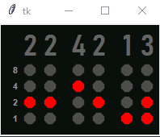
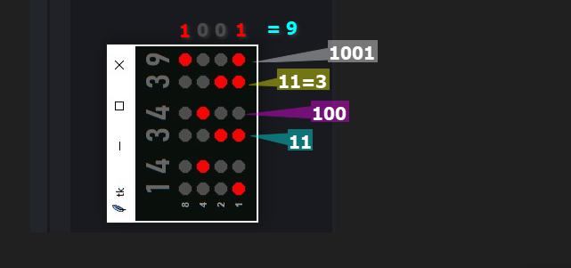
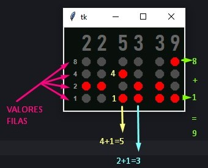

# RELOJ BINARIO

el reloj obtiene la hora del sistema y convierte en binario los digitos de la hora,

representa de manera visual con circulo rojos los unos y con circulos plomos los ceros

ademas que los valores de cada fila son **1**, **2**, **4**, **8**

y sumando los circulos activos (*rojos*) al sumar sus valores por fila se obtiene el valor del digito.

---

la interfaz esta echa con el Canvas de tkinter

